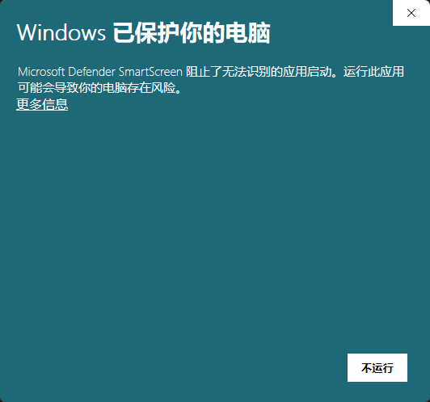

# PastePing · 剪贴板安全提醒

**简体中文** | [English](README.en.md)

> 在你把「内部批注 / AI 残留 / 敏感信息」复制到别处之前，安静地提醒你一次。

**全部功能完全免费，无内购、无功能锁、无试用期。** 全程本地运行，**零网络请求**，剪贴板内容永不落盘。

[](LICENSE)
[](#安装)
[](https://www.python.org/)
[](#为什么可以信任它不是口头承诺)

[下载最新版](https://github.com/chengkaide/pasteping/releases/latest) ·
[使用说明](docs/user-guide.md) ·
[隐私声明](PRIVACY.md) ·
[贡献指南](CONTRIBUTING.md) ·
[安全策略](SECURITY.md)

---

## 目录

- [这个工具解决什么问题](#这个工具解决什么问题)
- [全部功能免费](#全部功能免费)
- [为什么可以信任它（不是口头承诺）](#为什么可以信任它不是口头承诺)
- [功能一览](#功能一览)
- [安装](#安装)
- [首次运行：可能会看到 SmartScreen 提示](#首次运行可能会看到-smartscreen-提示)
- [使用](#使用)
- [检测规则](#检测规则)
- [自动清洗规则](#自动清洗规则)
- [格式转换](#格式转换)
- [开发](#开发)
- [已知限制](#已知限制)
- [许可证](#许可证)

---

## 这个工具解决什么问题

三类事故，都发生在「复制 → 粘贴」之间那几秒：

| 场景 | 后果 |
| --- | --- |
| 把带**内部批注**的内容发给客户 | 「勿外传」「供内部参考」跟着正文一起出去 |
| 把 **AI 生成的残留**当自己的话发出去 | 「希望对你有帮助」「需要我帮你…」这类句子原样留在正文里 |
| 把**手机号 / 身份证 / API Key** 贴进聊天框 | 敏感信息泄漏 |

PastePing 常驻托盘，**在你复制的那一刻**检测一次，命中就把托盘图标变红 2 秒并弹一条通知。
它不弹窗打断你、不改你的按键习惯（照常 `Ctrl+C` / `Ctrl+V`）、不做任何联网。

## 全部功能免费

**本项目所有功能完全免费开放。**

- 三类检测、提醒、降频、暂停、总开关 —— 免费
- 自动清洗后粘贴、撤销 —— 免费
- Markdown → Word、网页表格 → Excel —— 免费

**没有内购、没有功能锁、没有试用期、没有使用次数或长度限制。**

如果这个工具帮到了你，可以选择自愿赞助（托盘菜单「支持开发者」），
**赞助不解锁、不改变任何功能** —— 全部功能你在赞助之前就已经有了。
赞助只是支持继续维护：[爱发电](https://afdian.com/a/pasteping)。

> 本项目采用 **GPL-3.0**，任何人都不能拿它做成「功能收费 + 闭源」的版本
> （衍生作品必须同样开源，源码免费可得）。详见[许可证](#许可证)。

## 为什么可以信任它（不是口头承诺）

隐私工具最常见的坑是「嘴上说不联网」。**开源的意义就在于这句话变成可验证的**。

本项目：

1. **零网络请求** —— 客户端不 `import` 任何网络库，没有遥测、没有自动更新，
   也**没有任何校验服务器**（本项目连激活 / 授权机制都不存在，自然不会去校验）；
2. **剪贴板内容永不落盘** —— 只在内存中处理，用完即弃；
3. **本地只有一个写盘文件**，就是诊断日志 `%APPDATA%\PastePing\pasteping.log`，
   里面只有文本长度、哈希前 8 位、命中的规则名与决策，**不含剪贴板原文**、也不含任何码值。

**你可以自己验证这三条：**

```bash
# 1) 搜网络调用：正常情况下应无输出
grep -rnE "^\s*(import|from)\s+(socket|ssl|urllib|http|requests|ftplib|smtplib|telnetlib)\b" *.py

# 2) 搜任何写盘行为
grep -rnE "open\(|\.write\(|os\.remove|shutil\." *.py

# 3) 拔掉网线，或用防火墙拦掉它的全部出站连接 —— 功能完全不受影响
```

详细说明见 [PRIVACY.md](PRIVACY.md)。

## 功能一览

| 能力 | 说明 |
| --- | --- |
| 三类检测 | 内部批注 / AI 残留 / 敏感信息 |
| 复制时提醒 | 托盘图标变红 2 秒 + 系统气泡通知 |
| 60 秒降频 | 同一段文本不重复打扰 |
| 暂停 5 分钟 / 1 小时 | 临时静默，到点自动恢复 |
| 总开关 | 一键停用检测 |
| 自动清洗后粘贴 | 写回剪贴板 + 「撤销上次清洗」 |
| Markdown → Word | 生成 `.docx` |
| 网页表格 → Excel | 生成 `.xlsx` |
| 打开结果文件夹 | 转换产物一键定位 |

**不做的功能（有意为之）：**

- **不提供命令行 / 图形设置面板** —— 配置入口只有托盘右键菜单，零学习成本；
- **不提供「去除 AI 水印」功能** —— 清理不可见字符是数据卫生，但规避厂商统计水印涉及
  欧盟 AI Act 第 50 条的透明度义务，本项目不做。详见 [AI 水印检测评估](docs/ai-watermark-detection.md)。

## 安装

### 方式一：下载预编译版（推荐，无需 Python）

1. 到 [Releases](https://github.com/chengkaide/pasteping/releases/latest) 下载 `PastePing.exe`；
2. **首次运行前请先"解除锁定"**（原因见下一节）；
3. 双击运行，托盘出现图标即成功。

### 方式二：包管理器

```powershell
# 若已提交到 winget / scoop（待办）
winget install PastePing
```

> 包管理器安装**不会**给文件打网络标记，通常可直接运行。

### 方式三：从源码运行

```bash
git clone https://github.com/chengkaide/pasteping.git
cd pasteping
python -m pip install -r requirements.txt
python main.py
```

运行时依赖共 **5 个**：`pywin32` / `pystray` / `Pillow` / `python-docx` / `openpyxl`。

## 首次运行：可能会看到 SmartScreen 提示

未做代码签名的 exe 从浏览器下载后，Windows 会显示：

> **Windows 已保护你的电脑** —— Microsoft Defender SmartScreen 阻止了无法识别的应用启动。



**点「更多信息」→「仍要运行」即可。**

这一屏与程序本身无关，**触发条件是「网络标记」（Mark-of-the-Web），不是"未签名"本身**。
所以有两个更彻底的办法：

**办法一（推荐）：先解除锁定**

右键 `PastePing.exe` → 属性 → 底部勾选 **「解除锁定」** → 确定。
或者一行命令：

```powershell
Unblock-File .\PastePing.exe
```

**办法二：用包管理器安装**（不经过浏览器，不带网络标记）。

> 本项目正在申请 [SignPath Foundation](https://signpath.org/) 为开源项目提供的免费代码签名。
> 拿到证书后，发布版会带上正式签名，上述提示将不再出现。
> 背景与实测记录见 [docs/code-signing.md](docs/code-signing.md)。

## 使用

启动后程序常驻系统托盘（可能需要从「隐藏的图标」区拖到常驻区）。

**托盘图标的含义：**

- 深灰底白色「P」= 运行中、待命；
- **红底白色「P」** = 刚检测到内容会提醒，2 秒后自动恢复灰色。

> 图标变红是本工具**最可靠的提醒信号** —— 系统气泡通知可能被「专注助手 / 勿扰模式」静音。

**托盘菜单：**

- ☑ 敏感提醒：总开关（勾选框）
- ☑ 自动清洗粘贴：勾选后命中时自动清洗并写回剪贴板（默认关闭）
- 撤销上次清洗：仅在有可撤销的清洗时出现
- 格式转换 ▸：Markdown → Word / 网页表格 → Excel / 打开结果文件夹
- 暂停 5 分钟 / 暂停 1 小时
- 支持开发者 ¥3（纯自愿，不影响任何功能）
- 关于 / 退出

**排查「复制了没提示」**：查看 `%APPDATA%\PastePing\pasteping.log`。
日志只记录长度、哈希前 8 位、命中的规则名与决策，**不含剪贴板原文**，可放心外发。
启动时控制台也会打印该路径。

## 检测规则

| 类别 | 检测范围 | 示例规则 |
| --- | --- | --- |
| 内部批注 | 提醒：首尾各 200 字；清洗：全文 | 转发文案 / 内部使用 / 勿外传 / 备注： / 仅供…参考 / 【批注】 / `>` 引用块 / —— 补充 |
| AI 残留 | 提醒：首尾各 200 字；清洗：全文 | 开头：当然可以 / 以下是 / 好的我 / 没问题；结尾：希望对你有帮助 / 需要我帮你 … |
| 敏感信息 | 全文 | 身份证 / 手机号 / API Key / 银行卡（片段自动脱敏） |

**优先级**：敏感信息 > 内部批注 > AI 残留。同一段文本 60 秒内只提醒一次。

### 降误报门槛

`detector.TIGHTEN` 是一组**可独立开关**的收敛门槛。当前档位把误报率从 58.3% 降到 **8.3%**，
召回率保持 100%（实测方法见 [docs/false-positive-benchmark.md](docs/false-positive-benchmark.md)）：

| 杠杆 | 门槛 | 默认 |
| --- | --- | :---: |
| `disclaimer` | 「仅供…参考」需同窗口出现批注语义词 | 开 |
| `structure` | 行首 `>` 引用块 / `——` 补充说明需同窗口出现批注语义词 | 开 |
| `bracket` | `【…】` 需方括号**内文**含批注语义词 | 开 |
| `bankcard` | 16–19 位数字需通过 Luhn 校验，或邻近出现卡类上下文词 | 开 |
| `low_signal_keywords` | `注：` / `备注：` / `请确认` / `请审阅` 需同窗口出现**强**语义词 | 开 |
| `ai_boundary` | AI 特征必须贴身于文本首尾（会把 200 字窗口收窄到 8 字） | **关** |

> 语义词指「内部 / 勿外传 / 保密 / 草案 / 待定 / 待确认 / 批注 / 备注 …」这类无歧义的
> 内部语境词。调档位前请先跑 `python tools/fp_lab.py`（全组合穷举 + Pareto 前沿）。

### 自测样例（可直接复制）

想看「到底什么会提醒、什么不会」，用现成的样例集，不必自己猜：

```bash
python tools/gen_test_samples.py            # 核对全部样例并生成文档
python tools/gen_test_samples.py --clip S3  # 把某条样例复制到剪贴板，去真机试
```

34 条样例（21 条「应提醒」+ 13 条「不该提醒」）逐条标注预期结果与原因，生成
[docs/test-samples.md](docs/test-samples.md)。生成器会**实跑 `detector.detect()` 核对每一条**，
不一致即以退出码 1 报错 —— 所以这份样例集是**行为契约**，不是随手写的文本，
并由 `tests/test_test_samples.py` 持续守护。

## 自动清洗规则

| 类别 | 处理方式 |
| --- | --- |
| AI 残留 | **删除**命中的开头 / 结尾特征整句 |
| 内部批注 | **删除**命中的关键词 / `【批注】` / 行首 `>` 引用块 / `——` 补充句 |
| 敏感信息 | **替换为占位符** `［已移除：身份证 / 手机号 / API Key / 银行卡］` |

**安全阀**：若清洗将移除超过 60% 字符，则**放弃清洗、仅提醒**（防止误删大段内容）。
清洗后可经菜单「撤销上次清洗」恢复原文（仅内存，原文不落盘）。

## 格式转换

- **Markdown → Word**：支持标题、有序/无序列表、加粗/斜体、行内代码、引用、管道表格、代码块；
- **网页表格 → Excel**：优先解析剪贴板 `CF_HTML` 中的 `<table>`（`colspan` 向右填充、`rowspan` 向下补空占位）；
  无 `CF_HTML` 时按制表符 / 管道符降级解析；
- 产物自动保存到 `%USERPROFILE%\Documents\PastePing\`，
  文件名 `PastePing_YYYYMMDD_HHMMSS_<后缀>.(docx|xlsx)`，**全程零对话框**；
- 无法对齐的复杂嵌套表降级为「按出现顺序铺格」并附提示，**不报错、不崩溃**。

## 开发

```bash
# 环境
python -m pip install -r requirements.txt
python -m pip install pytest            # 测试（可选）
python -m pip install pyinstaller       # 打包（可选）

# 测试（全量）
python -m pytest -q

# 真机自检：在真实 Windows 上跑通剪贴板全链路（会临时占用剪贴板，结束自动还原）
python tools/smoke_test.py

# 打包单文件 exe
python tools/make_icon.py               # 生成 exe 图标（打包时会自动刷新，通常不用手跑）
python tools/build_exe.py               # 打包 + 自动做产物安全检查

# 误报率基准 / 调参
python tools/fp_benchmark.py            # 当前档位实测
python tools/fp_lab.py                  # 全组合穷举 + Pareto 前沿
```

**架构**：依赖方向严格单向，按「层」组织 —— **第 N 层只许 import 比它低的层，绝不允许反向**。
要看某一个模块 import 了谁，直接在下面找到它的那一行即可：

```
第 0 层   零本项目依赖（可以直接离线单测，不需要 Windows / 托盘 / 剪贴板）
          config        全局状态 + 一把 RLock
          detector      三类检测规则（纯逻辑，无 GUI、无 Windows）
          diagnostics   本地诊断日志（只记指纹，不记原文）

第 1 层   只依赖第 0 层
          cleaner            → detector
          notifier           → detector, diagnostics
          dialogs            → diagnostics
          clipboard_io       → （仅 win32clipboard，无本项目依赖）

第 2 层   依赖第 1 层
          clipboard_listener → clipboard_io, diagnostics
          converter          → clipboard_io

第 3 层   托盘与装配
          tray               → config, converter, dialogs, diagnostics
          main               → tray, notifier, clipboard_listener,
                               cleaner, config, detector, diagnostics
```

> `tray` 位于第 3 层，却在运行时用到第 1 层的 `cleaner` 与第 2 层的
> `clipboard_listener` —— 这两个对象由 `main` 用 `attach_cleaner()` /
> `attach_listener()` / `attach_notifier()` **注入**（鸭子类型），
> 所以 `tray` 的 import 列表里看不到它们，也就不会形成反向依赖。

四条不可违反的规则：

- `config` 不 import 本项目任何模块；
- `detector` 不 import `config`（保证它能脱离运行时状态、离线跑几万条语料）；
- `notifier` 不 import `tray`（通知与托盘解耦，测试里可把托盘整个换成记录器）；
- `tray` 不 import `cleaner` / `clipboard_io` / `clipboard_listener`（一律用注入）。

**想改代码请先读 [代码导读（docs/code-tour.md）](docs/code-tour.md)** ——
它讲清了运行时线程模型、三条数据流、冻结契约、常见改动该动哪个文件，
以及一份前人踩过的坑清单。

**开发约定**（提 PR 前请先读 [CONTRIBUTING.md](CONTRIBUTING.md)）：

- 异常必须**静默且安全** —— 任何失败都不得崩进程；
- 敏感信息的数字位统一用 ASCII `[0-9]`，**不用** Unicode `\d`（否则全角数字会误分类）；
- 改 `detector.detect()` 的签名、`Hit` 字段或既有常量属**冻结契约变更**，需在 PR 中单独说明。

## 已知限制

- **仅支持 Windows**（依赖 Win32 API 与系统托盘）；
- **检测规则仍有约 8.3% 误报**（3/36），集中在「没问题 / 好的我 / 需要我帮你」这类日常寒暄；
  收紧带来的**漏报侧代价**：单独出现的 `备注：` / `注：` / `仅供参考` / `> 引用块` / `—— 补充说明`
  现在需要同屏出现「内部 / 勿外传 / 保密 / 草案 / 待定」这类词才会提醒；
- 检测基于**固定规则**，不是模型，**必然存在漏检** —— 请勿把它当作数据保护的唯一防线；
- 打开外部链接使用 `os.startfile → ShellExecuteW → webbrowser` 三级降级（见 `tray.open_url`）；
- 未签名 exe 从浏览器下载后首次运行会撞 SmartScreen（见[上文](#首次运行可能会看到-smartscreen-提示)）。

## 许可证

[GNU General Public License v3.0](LICENSE)（GPL-3.0）。

```
Copyright (C) 2026 PastePing

This program is free software: you can redistribute it and/or modify
it under the terms of the GNU General Public License as published by
the Free Software Foundation, either version 3 of the License, or
(at your option) any later version.

This program is distributed in the hope that it will be useful,
but WITHOUT ANY WARRANTY; without even the implied warranty of
MERCHANTABILITY or FITNESS FOR A PARTICULAR PURPOSE.  See the
GNU General Public License for more details.

You should have received a copy of the GNU General Public License
along with this program.  If not, see <http://www.gnu.org/licenses/>.
```

**这意味着**：你可以自由使用、修改、分发本软件，包括收费分发；
但**衍生作品必须同样以 GPL-3.0 开源**，不能做成闭源收费版。

## 免责声明

PastePing 是一款**辅助提醒**工具，不构成任何形式的数据保护或合规承诺。
检测基于固定规则，**可能存在漏检（未提醒）与误检（误提醒）**。
自动清洗与格式转换按「所见即所得」处理，**不保证 100% 还原原文语义或排版**，
清洗后的内容请在粘贴前自行确认。因使用本工具产生的任何直接或间接损失，开发者不承担责任。
