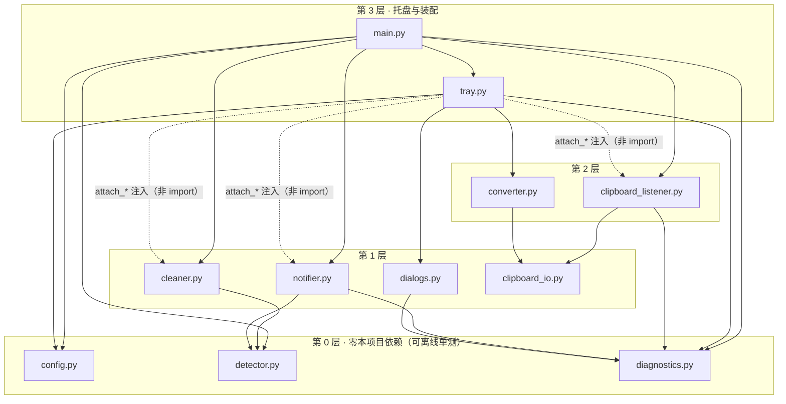

# 代码导读（改代码之前先读这一份）

> 目标读者：想改 PastePing 的人 —— 包括几个月后的你自己。
>
> 这份文档不重复「产品怎么用」（那是 [`user-guide.md`](user-guide.md)），
> 只回答**改代码时最费时间的四个问题**：
> 1. 它运行时到底是什么样的（几个线程、谁在等谁）？
> 2. 想改某个行为，该动哪个文件？
> 3. 哪些东西是**不能随便动**的（冻结契约）？
> 4. 前人踩过哪些坑（照着踩一遍要花好几个小时的那种）？

规模：**11 个客户端模块 / 约 3800 行**，16 个测试文件 / 349 条用例。
纯 Python 标准库 + 5 个第三方包，**零网络请求**。

---

## 一、60 秒看懂它做什么

一句话：**监听剪贴板，在用户把东西粘贴到别处之前，安静地提醒一次。**

```
用户 Ctrl+C
  → Win32 推来 WM_CLIPBOARDUPDATE（事件驱动，不轮询）
  → 读取剪贴板文本
  → 三类规则依次判定：敏感信息 / 内部批注 / AI 残留
  → 命中：托盘图标变红 2 秒 + 一条气泡通知
          （若用户开了「自动清洗粘贴」，则改写剪贴板内容，让粘出来的是干净的）
```

**三种命中类别**，优先级 `sensitive > internal_note > ai_residue`，同时命中只报最严重的一条：

| 类别 | 常量 | 扫描范围 | 例子 |
| --- | --- | --- | --- |
| 敏感信息 | `CATEGORY_SENSITIVE` | **全文** | 手机号、身份证、API Key、银行卡 |
| 内部批注 | `CATEGORY_INTERNAL_NOTE` | 首尾各 200 字 | 「内部资料」「备注：」「> 引用块」 |
| AI 残留 | `CATEGORY_AI_RESIDUE` | 首尾各 200 字 | 「当然可以」「希望对你有帮助」 |

> 「敏感信息全文扫描、另两类只看首尾 200 字」是**产品规格写死的**，不是实现偷懒。
> 改动它之前先读 [`test-samples.md`](test-samples.md) 里的 S7 与 N8 两条对照样例。

---

## 二、运行时模型：三个线程 + 一个隐藏窗口

这是理解全部并发问题的钥匙。

```
主线程
  └─ tray.icon.run()            pystray 消息循环（Windows 托盘图标必须由主线程跑）
                                所有菜单回调都在这里执行

剪贴板线程 "PastePingClipboard"（daemon）
  └─ Win32 消息循环 GetMessageW / DispatchMessageW
       └─ message-only 隐藏窗口 "PastePingMessageWindow"
            └─ AddClipboardFormatListener → WM_CLIPBOARDUPDATE
                 └─ 读取剪贴板 → on_text(text) → 也就是 main.handle_text 闭包
                    ⚠️ 检测与清洗**都在这个线程里同步执行**

临时线程（每次闪烁一个）
  └─ threading.Timer(2.0)       2 秒后把图标从红色变回灰色
     用「代号（generation）」防止旧定时器把新闪烁提前掐灭 —— 见 notifier._flash/_flash_end
```

（2026-10-07 之前还有一个 `"PastePingTkDialog"` 线程用于激活码输入框，
随「付费解锁」整层移除一并删除 —— 现在**不再有任何临时 GUI 线程**。
所有弹窗都走 `dialogs`，在主线程里以 `MessageBoxW` 模态弹出。）

**由此推出两条必须记住的并发事实**：

1. **`config` 是唯一的共享可变状态**，被剪贴板线程与主线程同时读写 →
   所以它只有一把 `threading.RLock`，**所有读写都必须持锁**，新增状态只许做加法。
2. `on_text` 在**剪贴板线程**里跑。任何在里面做的事都会**阻塞下一条剪贴板事件**。
   所以 `handle_text` 里绝不允许出现网络请求、模态对话框、长时间循环。
   （格式转换没走这条路 —— 它是菜单触发的，跑在主线程。）

---

## 三、模块地图

依赖方向是**单向**的，这是本工程最重要的一条架构约束（下一节讲为什么）。

| 文件 | 职责 | 它 import 了谁 | 改动频率 |
| --- | --- | --- | --- |
| `main.py` | 入口：装配所有模块、定义 `handle_text` 闭包、启动监听 | 几乎所有人 | 低 |
| `config.py` | **全部可变全局状态** + 一把 RLock | *（本项目模块：无）* | 中 |
| `detector.py` | 检测规则（纯逻辑，无 GUI / 无 Windows） | *（无）* | **高** |
| `cleaner.py` | 按 `Span` 改写文本、安全阀、撤销快照 | `detector` | **高** |
| `clipboard_io.py` | 剪贴板读写原语（含 CF_HTML 切片） | *（仅 `win32clipboard`）* | 低 |
| `clipboard_listener.py` | Win32 事件驱动监听 + **写回抑制** | `clipboard_io`, `diagnostics` | **低（高风险）** |
| `notifier.py` | 通知 + 图标闪烁编排 | `detector`, `diagnostics` | 低 |
| `tray.py` | 托盘图标、右键菜单、全部菜单回调 | `config`, `converter`, `dialogs`, `diagnostics` | 中 |
| `converter.py` | Markdown→Word、网页表格→Excel | `clipboard_io` | 中 |
| `dialogs.py` | 系统对话框 + **「同一时刻只允许一个框」闸门** | `diagnostics` | 低 |
| `diagnostics.py` | 本地诊断日志（只记指纹，不记原文） | *（无）* | 低 |

> `tray` 在运行时还会用到 `cleaner` 与 `clipboard_listener`，但**不 import 它们** ——
> 由 `main` 通过 `attach_cleaner()` / `attach_listener()` / `attach_notifier()` **注入**
> （鸭子类型）。所以「它 import 了谁」这一列看不到这两个名字，这是有意为之，不是遗漏。

### 依赖方向图



**读图规则只有一条：实线一律向下** —— 第 N 层只许 import 比它低的层。
虚线是**运行时注入**，不是 import，所以它跨越了层但没破坏方向。

### 为什么方向必须单向（不是洁癖）

* **`detector` 谁都不依赖** → 可以在**没有 Windows、没有托盘、没有剪贴板**的环境里
  直接跑几万条语料做回归。误报率能从 58.3% 压到 8.3%，靠的就是这个可测性
  （`tools/fp_lab.py` 会穷举 64 种规则组合）。
* **`notifier` 不 import `tray`** → 通知与托盘解耦，测试里可以把托盘整个换成记录器。
* **`tray` 不 import `cleaner` / `clipboard_listener`** → 用 `attach_cleaner()` /
  `attach_listener()` 注入鸭子类型对象。好处是托盘可以在没有真实剪贴板时被构造出来测菜单。
* **`config` 不 import 任何本项目模块** → 谁都能安全 import 它，不会绕出循环。

> 新增模块时请先想清楚它落在这张图的哪一层，**不要为了图方便反向 import**。

---

## 四、三条数据流

### A. 复制 → 检测 → 提醒 / 清洗（主干）

`main.handle_text` 是唯一的主干，一共 5 步：

```
1. config.is_detection_active()   —— 总开关 + 暂停期，任一不满足就静默返回
2. detector.detect(text)          —— 返回 Hit 或 None
3. config.should_emit(text)       —— 60 秒降频（按内容 sha256，不驻留原文）
4. config.get_clean_enabled()     —— 开了就走清洗分支，否则只提醒
      └─ cleaner.clean(text)      —— 触发安全阀（移除 >60%）则放弃清洗，退回「仅提醒」
      └─ listener.set_text(...)   —— 写回剪贴板（唯一写回路径）
5. notifier.notify(hit)           —— 通知 + 图标变红 2 秒
```

**⚠️ 第 4 步曾经是付费墙**：2026-10-07 之前这里是
`if config.get_unlocked() and config.get_clean_enabled():` ——
开头那 11 个字符 `config.get_unlocked() and` 就是整个付费墙。
现在 `get_unlocked()` **连函数带整套授权模块（`licensing` / `license_codec` / `ui_dialog`）
一并删除**，第 4 步只剩 `if config.get_clean_enabled():`。

这一点由 `tests/test_qa_v02_adversarial.py` 的守卫钉死，其中最强的一条是**行为侧**证明：
`test_cleaning_works_with_no_configuration`（**零配置** + 开清洗开关 ⇒ 剪贴板必须被清洗写回）。
它比「源码里搜不到某个字符串」更强 —— 后者改个名字就能绕过，前者只能靠真的把功能放开才通过。

### B. **写回剪贴板**为什么不会死循环（全项目最高风险点）

写回会再次触发 `WM_CLIPBOARDUPDATE`。如果不管它，就会「清洗 → 触发 → 又清洗 → …」。
`clipboard_listener._handle_update` 用**两道独立闸门**解决：

```
读到文本 text，算出 digest
  ① 抑制校验（优先）
     写回前 listener.set_text() 先登记 _suppress_digest = digest(新文本)
     → 命中则消费一次并 return，同时把 _last_digest 也设成它
  ② 内容哈希防抖（0.2 秒窗口）
     仅折叠「同一次复制」产生的重复同内容事件
     —— 关键：**内容不同的事件永不因防抖被丢弃**，
        否则用户的下一次真实复制会被无声吞掉
```

设计意图（v0.1 曾用「纯时间防抖」，会吞掉用户的真实复制）：
**① 精确到内容，② 只压重复**。实机验证：日志里每次清洗都是
`dispatch` → `clean applied` → `suppressed-writeback` 三步一组，没有多余循环。

### C. 「支持开发者」→ 打开赞助网页（**不参与任何功能、不改动任何状态**）

```
tray._on_support
  → open_url(SUPPORT_URL)     三级降级：os.startfile → ShellExecuteW → webbrowser
  → 若三级都失败，弹一个框把完整地址给用户，让他手动复制
  → diagnostics.log("open_url", ...)      只记 ok / 失败，不记别的
```

* 这条路径**不写盘、不验签、不设置任何开关** —— 赞助前后功能完全一致。
  托盘菜单里那句「不影响任何功能」不是修辞，就是这条代码路径的直白描述。
* 守卫在 `tests/test_qa_v02_adversarial.py::test_support_entry_changes_no_state`
  （快照 4 项 config 状态，前后必须一致）与
  `tests/test_click_responsiveness.py::test_support_hands_over_url_when_browser_fails`
  （浏览器打不开时必须把地址交给用户，不能静默）。
* 历史：2026-10-07 之前这里还有一条「输入支持者码 → Ed25519 验签 → 点亮支持者标识」的支线
  （私钥在 `tools/private_key.pem`、客户端只内置公钥）。整条支线已随付费层一并删除，
  说明文档 `license-keys-explained.md` 同时移除。

---

## 五、冻结契约（改这里必须走评审）

这些接口被大量测试与外部工具依赖，改动会连锁。**「冻结」不等于不能改，而是不能随手改。**

| 契约 | 位置 | 为什么冻结 |
| --- | --- | --- |
| `detect(text) -> Optional[Hit]` | `detector.py` | 签名与语义被 400+ 条语料回归依赖 |
| `Hit` 字段（`category/rule/fragment/...`） | `detector.py` | `notifier`、日记、测试都按字段名读 |
| `Span` 字段 + `find_spans(text)` | `detector.py` | `cleaner` 依赖它做区间改写；**清洗能力走 Span，不走去改 detect** |
| `_EDGE_WINDOW` / `_HEAD_SCAN` / `_TAIL_SCAN` = 200 | `detector.py` | **产品规格写死的数值**，收窄等于削弱产品承诺 |
| `_DEBOUNCE_SECONDS` = 0.2 / `_SUPPRESS_WINDOW` = 1.5 | `clipboard_listener.py` | 与写回抑制的正确性强耦合 |
| `config` 的全部 getter/setter 名 | `config.py` | 托盘、测试、守卫都按名调用 |

> 历史教训：曾把 AI 扫描窗口从规格的 200 字「优化」成 120 字，被 QA 守卫当场抓出。

---

## 六、状态与并发：谁保护什么

| 状态 | 保护方式 | 注意 |
| --- | --- | --- |
| `config` 全部可变状态 | 一把模块级 `RLock` | 判断 + 写入**必须在同一把锁内**完成（见 `should_emit`） |
| `cleaner._undo_snapshot` | `cleaner._UNDO_LOCK` | 只保留**最近一次**清洗；原文**只在内存、不落盘** |
| `ClipboardListener` 的防抖/抑制字段 | 实例级 `Lock` | 只在剪贴板线程写，但 `stop()` 会从别的线程读 `_hwnd` |
| `Notifier._flash_gen` / `_timer` | 实例级 `Lock` | 用代号防「旧计时器掐灭新闪烁」 |
| `diagnostics._enabled` | 无锁（bool 读写原子） | 运行测试时由 `tests/conftest.py` 关闭 |

**统一异常策略（贯穿全项目）：静默且安全。**
清洗失败、转换失败、剪贴板失败、日志失败一律**不得崩进程、不得损坏已有状态、
不得改动剪贴板**。失败返回 `None` / `False`，需要让用户知道的才升到 `dialogs`。

---

## 七、常见改动：改哪里

| 你想做的事 | 改哪里 | 必须同时做 |
| --- | --- | --- |
| 新增一条检测关键词 | `detector._INTERNAL_KEYWORDS` 等 | 跑 `tools/fp_lab.py` + 更新 `test-samples.md` |
| 调整误报/召回取舍 | `detector.TIGHTEN` 六个杠杆 | **先跑 `tools/fp_lab.py`**，再同步 `false-positive-benchmark.md` |
| 改清洗后的措辞 / 占位符 | `cleaner.CLEAN_PLACEHOLDER` | 检查 `tests/test_cleaner.py` |
| 改安全阀阈值 | `cleaner.CLEAN_MAX_REMOVAL_RATIO` | 同上 |
| 改托盘菜单项 | `tray._build_menu` | 回调必须套 `@_guarded`，且**每次点击都要有响应** |
| 改图标 | `tray.make_icon_image` + `tools/make_icon.py` | **渲染成 PNG 目视确认**，并保持 `tests/test_tray_icon.py` 的结构断言 |
| 改对话输出目录 | `converter.CONVERT_OUTPUT_DIR` | 确认 `os.makedirs(exist_ok=True)` |
| 新增面向用户的可改常量 | `config.py` 顶部 | 若仍需填写，加进 `tray.pending_placeholders()` |
| 新增客户端模块 | 新建文件 | **同时加进 `tests/test_qa_v02_adversarial.py` 的 `CLIENT_MODULES`**，否则守卫不覆盖它 |

---

## 八、陷阱清单（都是真踩过的）

### 打包 / Windows API

1. **`ctypes.windll.user32 is ctypes.WinDLL("user32")` 为 `False`** —— 它们是**两个不同的
   DLL 实例**，而**函数原型（`argtypes` / `restype`）挂在 DLL 对象上、并不共享**。
   `clipboard_listener.py` 用 `WinDLL("user32")`，`dialogs.py` 用 `ctypes.windll.user32`，
   于是双方给同一个函数声明的 64 位句柄原型**互相看不见、还可能互相覆盖** ——
   症状是 64 位句柄被静默截断成低 32 位：**不报错，但拿到一个假句柄**。
   做法：需要可靠原型时**自己持有 DLL 句柄、每次调用前重新声明**，别依赖全局缓存对象。
2. **必须显式 `--exclude-module numpy`**：源码从不 import 它，是 PyInstaller 经 PIL 的
   hook 条件拉进来的，实测多占 10 MB（34.6 → 24.4 MB）。2026-10-07 移除授权体系后
   （`cryptography` 不再被引入）当前产物为 **20.8 MB**。
3. **`--windowed` 让 `print` 全部消失**，排障请临时改 `--console`。
4. **覆盖 20 MB 的 exe 在本机构建环境里会失败**（删除被重定向）→ 先删旧产物再打包。
5. 打包脚本内置**正反双向检查**：不得出现私钥相关标识；必须出现
   `win32clipboard` / `pystray._win32` / `_imaging`。
   只查「不该有的没有」是不够的 —— 漏掉扩展模块时产物照生成、一运行才崩。
   另有一条**第三重检查**：读 PYZ 归档目录表，确认 11 个自研模块真的都在包里
   （纯 Python 模块被压缩进 PYZ，字节扫描看不见它们）。

### pystray（两个坑）

6. **`Icon.name` 是只读 property**。要改名字得改 `self._name`
   （`pystray/_base.py`）。曾经写过一个「撞名重试」补丁，
   因为给只读属性赋值抛 `AttributeError`，**从未生效过**，
   于是「偶发失败」被误以为已修复、其实一直在发生。
7. **pystray 的 Win32 后端用 `id(self)` 拼窗口类名**
   （`'%s%dSystemTrayIcon' % (self.name, id(self))`）。
   对象被回收后地址复用 → `RegisterClassEx` 报
   `OSError: [WinError 1410] 类已存在`。
   测试里造多个托盘对象时**必须给每个实例一个唯一后缀**
   （见 `tests/conftest.py::_register_class_with_unique_name`）。

### 实现细节

8. **敏感信息正则统一用 ASCII `[0-9]`，不要用 `\d`** —— `\d` 会匹配全角数字，
   导致「全角写法」被误分类（对照样例 N10）。
9. **`cleaner.undo()` 返回的 `CleanResult.cleaned_text` 是「恢复后的原文」**，
   名字容易读反 —— 它不是「清洗后的文本」。
10. **不要在 `handle_text` 里做重活**（见第二节：它跑在剪贴板线程里）。
11. **打开外部链接一律走 `tray.open_url()`**（`os.startfile` → `ShellExecuteW` →
    `webbrowser` 三级降级），不要直接 `webbrowser.open()` ——
   打包后无控制台时它可能静默失败，用户报的就是「点了没反应」。
12. **诊断日志严禁记录剪贴板原文、任何码值或令牌**，只能用
    `diagnostics.describe(text)`（长度 + 哈希前 8 位）。
13. **菜单项不允许「点了没反应」**。曾有 `_clean_guide_shown`「只弹一次」标记，
    导致增强功能菜单项首次点击后变成死按键，已删除且不再恢复。
    所有回调必须套 `@_guarded`。
14. **写客户端模块时避免出现「¥ + 数字」「数字 + 元」** ——
    QA 的价格守卫按**金额形态**匹配并剥离注释。金额一律引用 `config` 常量。

---

## 九、动手之前：跑什么

```bash
# 1. 全量测试（349 条，约 8 秒）
python -m pytest -q

# 2. 真机自检：真实 Win32 剪贴板全链路（会临时占用剪贴板，结束自动还原）
python tools/smoke_test.py            # 完整
python tools/smoke_test.py --quick    # 只查订阅

# 3. 改了检测规则之后必须跑
python tools/fp_lab.py                # 64 组合穷举 + Pareto 前沿（误报/召回取舍）

# 4. 样例集是行为契约，任何一条不符都退出码 1
python tools/gen_test_samples.py --check

# 5. 打包 / 备份
python tools/build_exe.py
python tools/make_backup.py --tar
```

`tools/smoke_test.py` 与单元测试的分工：单元测试用替身证明**逻辑对**；
自检脚本在**真实桌面上**证明**它在这台机器上真的会工作** ——
后者回答的是「把 exe 双击起来到底行不行」，那是单元测试回答不了的。

---

## 十、新增一条检测规则的标准流程

1. 在 `detector.py` 找到对应类别，**新增**规则（不要改既有规则的语义）；
2. 判断它属于哪一类杠杆：需要语义词共现就挂在 `_rule_gate_ok` 一类门槛下，
   并**新增一个可独立开关的 `TIGHTEN` 键**（默认 `False`，先看数据再决定是否开启）；
3. 在 `tools/gen_test_samples.py` 的样例表里**同时**加一条「应命中」和一条「不该命中」；
4. `python tools/fp_lab.py` 看新杠杆对误报率 / 召回率的影响；
5. 定了档位就更新 `docs/false-positive-benchmark.md` 与 `TIGHTEN` 落档；
6. 跑 `python -m pytest -q`、`python tools/smoke_test.py`；
7. 若规则会改写文本，确认 `cleaner.find_spans` 侧的行为符合预期（尤其是区间重叠）。

> 记住那条交付经验：**有效的杠杆是「语义词共现门槛」，不是「位置收紧」** ——
> 误报样本的触发词常常就在第 0 字，收窄位置拦不住它们，只会误伤召回。

---

## 十一、这台机器上可复现的实机验证结论（2026-10-07）

不是「应该能工作」，而是**已经跑过**：

| 验证项 | 结果 | 证据 |
| --- | --- | --- |
| 剪贴板事件订阅 | ✅ | 日志 `[startup] clipboard-subscription-ok` |
| 复制 → 检测 → 气泡通知 | ✅ | 日志 `[notify] tray-bubble-ok`（真托盘气泡成功） |
| 自动清洗写回剪贴板 | ✅ | 剪贴板实际内容被替换为 `［已移除：手机号］` |
| 写回不引发死循环 | ✅ | 每次清洗严格是 `dispatch → clean applied → suppressed-writeback` 三步 |
| 零配置下清洗照常生效 | ✅ | 不设置任何配置、只勾选清洗开关，剪贴板内容即被改写（付费墙确已移除） |
| 干净文本不误报 | ✅ | 技术段落与「仅供参考」均未触发 |
| 撤销快照可回滚 | ✅ | `cleaner.undo()` 返回原文 |
| `tools/smoke_test.py` | ✅ 6/6 通过 | 见第九节 |

> 上表是 2026-10-07 的实机结论。同日之后「付费解锁」整层被移除（3 个模块 + 3 个测试文件），
> 端口层面**没有新增任何需要真机验证的东西** —— 被删掉的都是纯离线逻辑，删除本身由全量测试覆盖。
> 旧版曾有一行「tkinter 输入框 ❌ 本机不可用」，随 `ui_dialog.py` 一起消失了。

---

## 十二、还在路上的事（已知缺口，不是秘密）

* **真实 PDF / Word / 网页复制出来的文本带哪类字符** —— 未实测，
  是 AI 水印检测（[`ai-watermark-detection.md`](ai-watermark-detection.md)）落地前
  唯一值得补的实测；
* **GPT/Claude 等真实对话的原文样本** —— `ai_residue` 词表的低区分度问题
  （「没问题」「好的我」「需要我帮你」）需要真实样本才能继续调；
* **代码签名** —— 两条 ¥0 路线（绕开 MotW / SignPath Foundation）已调研，
  见 [`code-signing.md`](code-signing.md)；
* **CI** —— 尚未接 GitHub Actions。

---

## 附：术语对照

| 代码里的词 | 面向用户的说法 | 说明 |
| --- | --- | --- |
| `sensitive` | 敏感信息 | 手机号 / 身份证 / API Key / 银行卡 |
| `internal_note` | 内部批注 | 内部资料 / 备注 / 引用块 / 补充说明 |
| `ai_residue` | AI 残留 | AI 对话助手的口吻残留在正文里 |
| `Span` | （无） | 一段待处理区间，清洗用它做区间改写 |
| `Hit` | （无） | 一次检测结论（类别 + 规则名 + 脱敏片段） |
| `TIGHTEN` | （无） | 降误报杠杆开关组 |
| `SUPPORT_PRICE_CNY` | 「支持开发者 ¥3」 | 纯自愿打赏金额，**与功能无关** |

---

*如果这份文档与代码不一致，以代码为准，并请顺手把文档改对 —— 过期的导读比没有导读更害人。*
